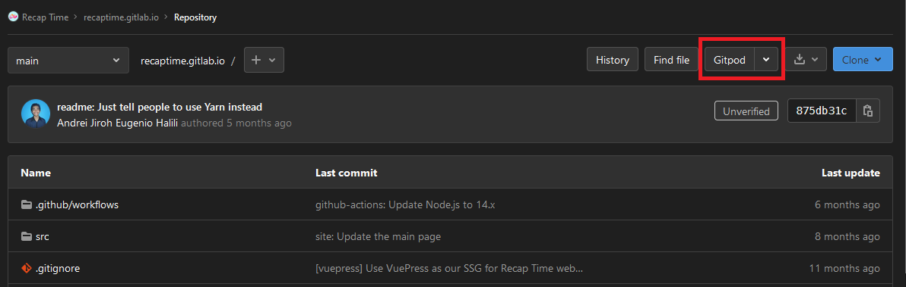
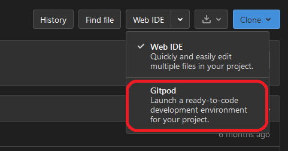

# Recap Time About Page

The repository contains source files for `recaptime.tk` (soon to be `about.recaptime.app`),
built with VuePress and hosted on Cloudflare Pages. While we accept PR from external people, be vary that there are some internal stuff there.

## Cloudflare Pages Project URLs and Adminstration

Our site can be accessible through one of these links:

* <https://recaptime-about-page.pages.dev> - Direct Cloudflare Pages link to production builds from `main`
* <https://about.recaptime.app>, <https://about.recaptime.tk> - Custom domains pointing to production builds

Only Recap Time Squad members can access the build logs and control Cloudflare Access settings to preview builds, usually granted through the usual process.

## Getting Started

### Locally

1. Clone the repository into your machine with `git clone https://gitlab.com/RecapTime/recaptime.gitlab.io ~/rtapp-about; cd ~/rtapp-about`.
2. Make sure atleast Node.js 14+ and Yarn Classic is installed globally. Install dependencies with `yarn install`, which will call `.yarn/releases/yarn-berry.cjs` instead due to the existence of `.yarnrc.yml`.
3. Run `yarn site:dev` (or `yarn dev`) on your current session.
4. On a new shell session or in VS Code, happy editing! When you're done with your work and ready for getting reviewed by your fellow squad member, `git add .`, `git commit --signoff` and `git push origin <your-branch>`.

### With Gitpod

1. Use the `Open in Gitpod` link with the GitLab project's menu by pressing `Gitpod` or `Open in Gitpod` button.

   

   If you're using Web IDE by default and want to switch to Gitpod, make sure [it's enabled on your account](https://docs.gitlab.com/ee/integration/gitpod.html#enable-gitpod-in-your-user-settings) and make the switch by pressing the caret beside `Web IDE` or `Open in Web IDE` and select Gitpod.

   
2. Sign in to Gitpod using your GitLab account, if prompted.
3. Wait for the workspace container to be fully initialized and the server is up. You can preview it when port `8080` starts to listen to HTTP requests.
4. Happy editing! When you're done with your work and ready for getting reviewed by your fellow squad member, `git add .`, `git commit --signoff` and `git push origin <your-branch>`.
